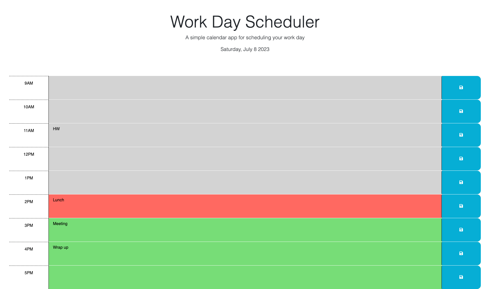

# Work Day Scheduler

## Description

This is a simple single work day scheduler which tracks my important tasks and events. It is color coded to show each if each hour is in the 
- Past (Gray)
- Present (Red)  
- Future (Green)

It also saves your events into local storage for future retrieval.

## Screenshot

  
    

## Links

[Github repository](https://github.com/vini3076/Work-day-scheduler)

[Deployed page](https://vini3076.github.io/Work-day-scheduler/)